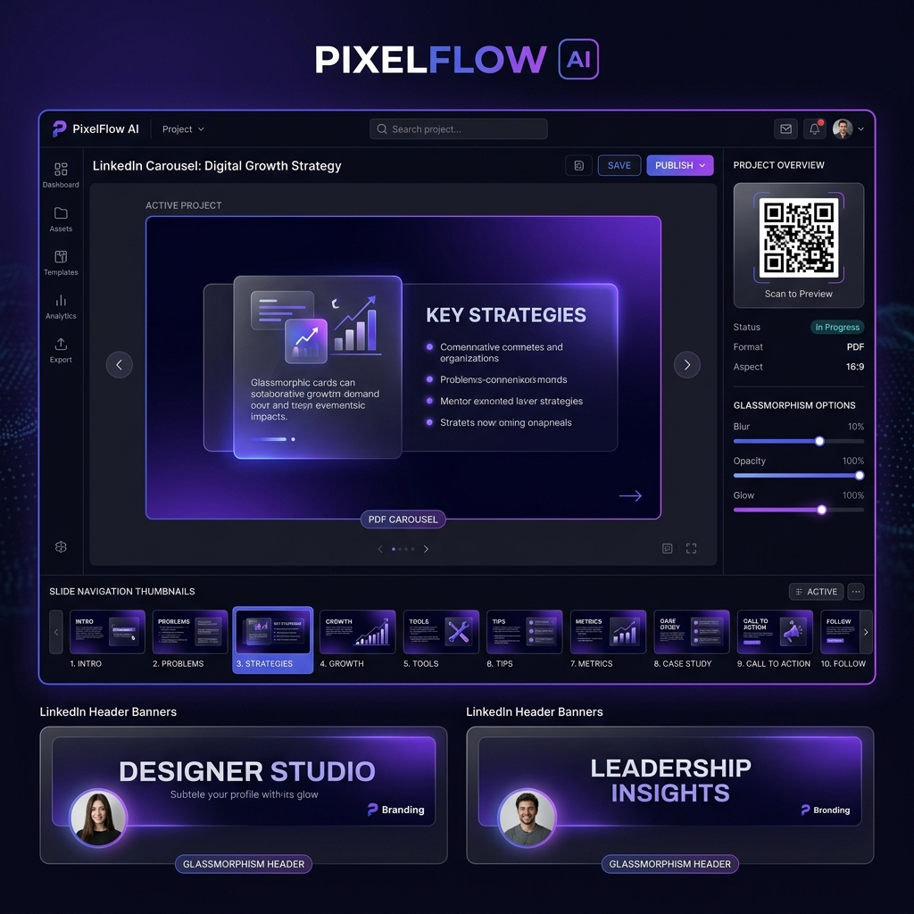
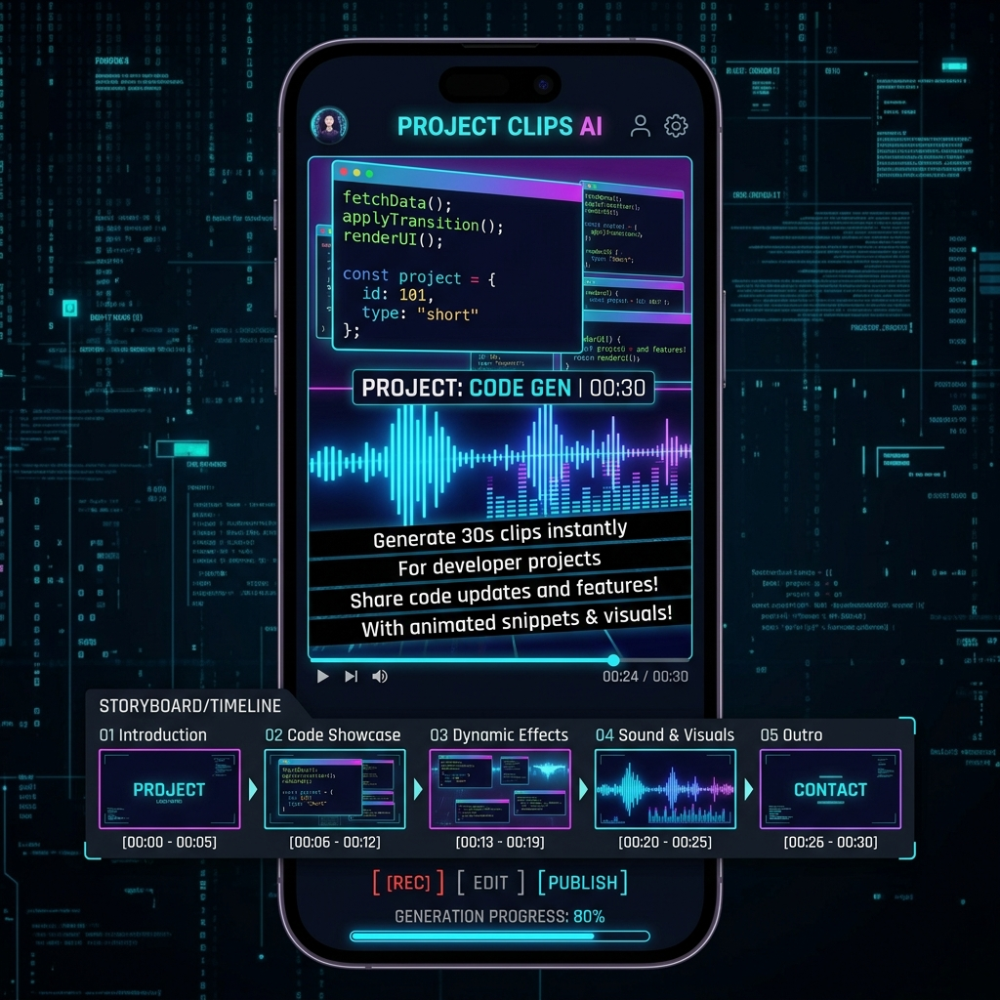

# RepoVision AI – GitHub Repository to LinkedIn Auto Publisher 🚀

[](https://github.com/vijaymahes9080/RepoVision-AI-GitHub-Repository-to-LinkedIn-Auto-Publisher)
[](LICENSE)
[](https://github.com/vijaymahes9080/RepoVision-AI-GitHub-Repository-to-LinkedIn-Auto-Publisher)
[](https://linkedin.com)
[](https://openai.com)

**RepoVision AI** is a fully cloud-hosted SaaS platform that automatically analyzes public or authorized GitHub repositories using AI, understands project architecture and tech stacks, generates professional LinkedIn content (Posts, Glassmorphism Banners, 10-Slide PDF Carousels, and 30-Second Shorts), and publishes them directly to LinkedIn via official OAuth APIs.

<p align="center">
  
</p>

---

## 💡 The Problem & The Solution

- 📌 **The Challenge:** Developers and open-source authors invest hundreds of hours building incredible projects, yet struggle to promote them consistently on LinkedIn due to the manual effort required to write posts, design graphics, and format carousels.
- ⚡ **The Solution:** RepoVision AI automates the entire GitHub-to-LinkedIn pipeline in the cloud. Just paste your repository URL and get a fully engineered LinkedIn campaign ready for instant scheduling or automated publishing.

---

## 🛠️ Complete System Workflow

```
               [ User Input Repository URL ]
                             │
                             ▼
                   [ GitHub OAuth / REST ]
                             │
                             ▼
             [ Cloud Repository Clone & AST Parser ]
                             │
                             ▼
             ┌───────────────┴───────────────┐
             │   AI Code Understanding       │
             │   • Read README.md & Files    │
             │   • Detect 30+ Frameworks     │
             │   • Extract System Architecture│
             └───────────────┬───────────────┘
                             │
                             ▼
               [ AI Multi-Format Generation ]
    ┌──────────────┬─────────┼─────────┬──────────────┐
    │              │         │         │              │
 [ LinkedIn ]  [ Visual ] [ Shorts ] [ Portfolio ] [ Twitter ]
 [ Content  ]  [ Banners] [ Video  ] [ Builder   ] [ Thread  ]
    └──────────────┴─────────┼─────────┴──────────────┘
                             │
                             ▼
            [ Live LinkedIn Desktop/Mobile Preview ]
                             │
                             ▼
            [ Official LinkedIn OAuth Publishing ]
                             │
                             ▼
            [ Analytics & Performance Insights ]
```

---

## 🔥 Visual Feature Showcases

### 🎨 1. Visual Studio & 10-Slide PDF Carousel Generator
Create high-DPI glassmorphism header banners and 10-slide technical PDF carousels tailored for LinkedIn algorithm optimization.

<p align="center">
  
</p>

---

### 📊 2. AI Post Analytics & Performance Insights
Track total impressions, views, engagement rates, follower growth, and receive AI recommendations for peak posting times.

<p align="center">
  
</p>

---

### 🎬 3. 30-Second AI Promotional Shorts Studio
Interactive vertical video player previewing animated code reveals, visual cues, AI voiceover narration transcript, and waveform audio visualizers.

<p align="center">
  
</p>

---

## 🚀 Module Capabilities Breakdown

### 1. 🤖 Automated GitHub Repository Analyzer
- **AST Tech Stack Extractor:** Automatically identifies 30+ frameworks across Frontend (React, Next.js, Angular, Vue), Backend (FastAPI, Node.js, Django, Spring Boot), Databases (PostgreSQL, MongoDB, Redis), AI/ML (LangChain, OpenAI, PyTorch), and Cloud/DevOps (Docker, AWS, Kubernetes).
- **Project Context Synthesis:** Extracts core problem statements, technical solutions, algorithms, and key innovations.

### 2. ✍️ LinkedIn AI Content Studio
- **Post Body Length Toggles:** Short Hook, Medium Post, Deep Dive.
- **High-Conversion AI Hooks:** Generates 3 hook options engineered for high feed retention.
- **Hashtag Suite & Prompts:** Contextual hashtag generator + custom DALL-E/Midjourney prompts.
- **Authentic Live Preview:** Real-time desktop & mobile LinkedIn post preview card with full character counts and social reaction buttons.

### 3. 🌐 AI Developer Portfolio Builder
- Automatically transforms analyzed GitHub repositories into an interactive developer portfolio website with project highlights, star metrics, and JSON data export.

### 4. 🛡️ AI Code Security & Quality Auditor
- AST security scanner checking for exposed secrets/API keys, CVE dependency vulnerabilities, strict TypeScript compliance, and open-source license verification (Score: 94/100 A+).

### 5. 💬 X (Twitter) 5-Tweet Viral Thread Studio
- Formats repository launch into a 5-tweet viral thread with emojis, technical breakdown, and repository link.

### 6. 📝 Dev.to / Medium / Hashnode Article Generator
- Generates long-form technical Markdown articles formatted for Dev.to, Medium, and Hashnode publishing.

### 7. 💼 AI Resume / CV Experience Bullet Generator
- Converts repository code & architecture into quantifiable, ATS-friendly resume experience bullets.

### 8. 📅 Official OAuth Scheduler & 1-Click Fallback Queue
- Schedule campaigns daily, weekly, or on custom dates.
- **Compliance Guarantee:** Where LinkedIn API scope restrictions apply, posts are queued for a **1-Click Review & Publish** workflow so your account stays 100% compliant.

---

## 💻 Tech Stack

- **Frontend:** React 19, Next.js / Vite, TypeScript, Tailwind CSS, Lucide Icons, Framer Motion
- **Backend / AI Engine:** FastAPI, Node.js, OpenAI GPT-5.5, LangChain
- **OAuth & Auth:** GitHub OAuth 2.0, LinkedIn OAuth 2.0, Google SSO, Email Magic Links
- **Database & Storage:** PostgreSQL, Redis Queue, AWS S3 / Cloudflare R2

---

## ⚡ Quick Start & Local Setup

### Prerequisites
- Node.js (v18+ or v20+)
- npm or yarn

### Installation

1. **Clone the repository:**
   ```bash
   git clone https://github.com/vijaymahes9080/RepoVision-AI-GitHub-Repository-to-LinkedIn-Auto-Publisher.git
   cd RepoVision-AI-GitHub-Repository-to-LinkedIn-Auto-Publisher
   ```

2. **Install dependencies:**
   ```bash
   npm install
   ```

3. **Start the local development server:**
   ```bash
   npm run dev
   ```
   Open `http://localhost:5173/` in your browser.

4. **Build for production:**
   ```bash
   npm run build
   ```

---

## 🛡️ Platform Compliance & Security

RepoVision AI strictly respects third-party platform terms:
- Uses official GitHub OAuth and REST API endpoints.
- Uses official LinkedIn OAuth 2.0 scopes.
- Never automates unauthorized scraping; defaults to 1-Click Review fallback queues when direct posting scope is unavailable.

---

## 👤 Author & License

- **Author:** Vijay Mahes
- **Email:** [Vijaypradhap2004@gmail.com](mailto:Vijaypradhap2004@gmail.com)
- **GitHub:** [@vijaymahes9080](https://github.com/vijaymahes9080)
- **License:** Distributed under the [MIT License](LICENSE).
